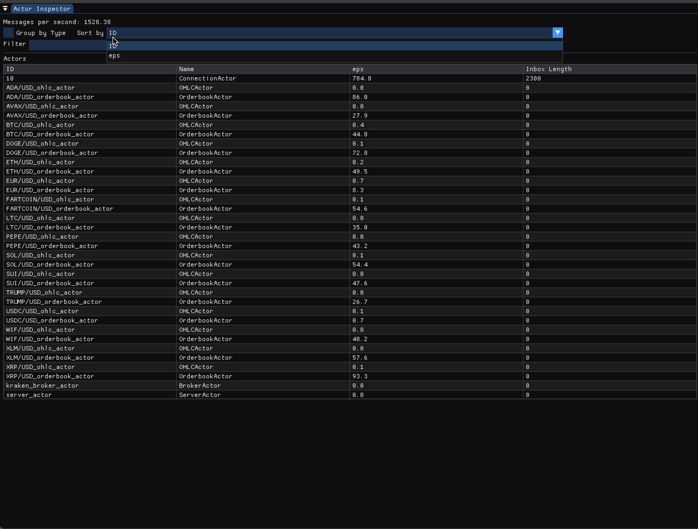

# Backstage: Actor Framework for Zig

Backstage is a high-performance, event-driven actor framework for the Zig programming language. Built on top of [libxev](https://github.com/mitchellh/libxev), it provides a robust foundation for building concurrent applications using the actor model pattern with automatic proxy generation.

## Key Features

- **Proxy-Based Actors**: Automatic code generation creates type-safe proxies for seamless actor communication
- **Method-Based Communication**: Actors expose public methods with automatic parameter serialization
- **Stream-Based Pub/Sub**: High-performance streaming system for publish/subscribe patterns
- **Event-Driven Architecture**: Built on libxev for high-performance, non-blocking I/O operations
- **Runtime Inspector**: Real-time monitoring and debugging of actor systems with a graphical interface
- **Type Safety**: Compile-time validation of actor method calls and parameters

## How It Works

Backstage uses code generation to create type-safe proxies for your actors. Simply mark your actor structs with `// @generate-proxy`, define public methods for your business logic, and the framework handles the rest.

### Simple Actor Example

```zig
const backstage = @import("backstage");
const std = @import("std");
const Context = backstage.Context;
const HelloWorldActorProxy = @import("generated/hello_world_actor_proxy.gen.zig").HelloWorldActorProxy;

// @generate-proxy
pub const HelloWorldActor = struct {
    ctx: *Context,
    allocator: std.mem.Allocator,
    message_count: u32 = 0,

    const Self = @This();

    pub fn init(ctx: *Context, allocator: std.mem.Allocator) !*Self {
        const self = try allocator.create(Self);
        self.* = .{
            .ctx = ctx,
            .allocator = allocator,
        };
        return self;
    }

    pub fn sayHello(self: *Self, name: []const u8) !void {
        self.message_count += 1;
        std.log.info("Hello, {s}! (Message #{d})", .{ name, self.message_count });
    }

    pub fn getCount(self: *Self) u32 {
        return self.message_count;
    }

    pub fn deinit(_: *Self) !void {}
};

pub fn main() !void {
    var gpa = std.heap.GeneralPurposeAllocator(.{}){};
    defer _ = gpa.deinit();
    const allocator = gpa.allocator();

    var engine = try backstage.Engine.init(allocator);
    defer engine.deinit();

    const actor = try engine.getActor(HelloWorldActorProxy, "hello_actor");
    try actor.sayHello("World");
    try actor.sayHello("Zig");

    try engine.loop.run(.once);
}
```

### Actor-to-Actor Communication

```zig
// @generate-proxy
pub const SenderActor = struct {
    ctx: *Context,
    allocator: std.mem.Allocator,

    pub fn init(ctx: *Context, allocator: std.mem.Allocator) !*Self {
        // Initialize actor
    }

    pub fn sendMessage(self: *Self, message: []const u8) !void {
        const receiver = try self.ctx.getActor(ReceiverActorProxy, "receiver");
        try receiver.processMessage(message);
    }

    pub fn deinit(_: *Self) !void {}
};

// @generate-proxy
pub const ReceiverActor = struct {
    ctx: *Context,
    allocator: std.mem.Allocator,

    pub fn init(ctx: *Context, allocator: std.mem.Allocator) !*Self {
        // Initialize actor
    }

    pub fn processMessage(self: *Self, message: []const u8) !void {
        std.log.info("Received: {s}", .{message});
    }

    pub fn deinit(_: *Self) !void {}
};
```

### Publish/Subscribe with Streams

```zig
// Publisher Actor
pub fn publishNews(self: *Self, headline: []const u8) !void {
    const stream = try self.ctx.getStream([]const u8, "news");
    try stream.next(headline);
}

// Subscriber Actor
pub fn subscribeToNews(self: *Self) !void {
    const stream = try self.ctx.getStream([]const u8, "news");
    try stream.subscribe(
        backstage.newSubscriber("subscriber_id", SubscriberProxy.Method.handleNews)
    );
}

pub fn handleNews(self: *Self, headline: []const u8) !void {
    std.log.info("Breaking news: {s}", .{headline});
}
```

## Installation

Add Backstage to your `build.zig.zon`:

```zig
.dependencies = .{
    .backstage = .{
        .url = "https://github.com/Thomvanoorschot/backstage/archive/main.tar.gz",
        .hash = "...", // Update with actual hash
    },
},
```

## Setup

### 1. Configure Build System

In your `build.zig`:

```zig
const backstage_dep = b.dependency("backstage", .{
    .target = target,
    .optimize = optimize,
    .generate_proxies = true,
});

// Set up proxy generation
const generator = backstage_dep.artifact("generator");
const run_generator = b.addRunArtifact(generator);
run_generator.addArg("src/generated"); // Output directory
run_generator.addArg("src");           // Source directory to scan
run_generator.addArg("other_dir");     // Multiple directories can be scanned by adding args

const gen_proxies = b.step("gen-proxies", "Generate actor proxies");
gen_proxies.dependOn(&run_generator.step);
b.getInstallStep().dependOn(gen_proxies);

// Add the backstage module to your executable
exe.root_module.addImport("backstage", backstage_dep.module("backstage"));
```

### 2. Generate Proxies

The generator can be invoked to create proxy files, but adding the above configuration will generate the proxies on every build.

```bash
zig build gen-proxies
```

This scans your source code for actors marked with `// @generate-proxy` and creates corresponding proxy files in the `src/generated` directory.

### 3. Import and Use

```zig
const MyActorProxy = @import("generated/my_actor_proxy.gen.zig").MyActorProxy;

// Use the proxy to interact with your actor
const actor = try engine.getActor(MyActorProxy, "unique_actor_id");
try actor.myMethod(parameters);
```

## Examples

The framework includes comprehensive examples demonstrating various patterns:

- **hello_world_string.zig** - Basic actor with simple method calls
- **hello_world_struct.zig** - Passing custom structs as parameters
- **actor_to_actor.zig** - Direct actor-to-actor communication
- **pub_sub.zig** - Publish/subscribe messaging with streams
- **multiple_methods.zig** - Actors with multiple business methods
- **large_struct.zig** - Handling complex data structures
- **array_list_actor.zig** - Working with collections and dynamic data
- **poison_pill.zig** - Actor shutdown patterns

Run any example:

```bash
cd examples
zig build hello_world_string
```

## Inspector

The inspector provides real-time visibility into your actor system through a graphical interface:

### Enable Inspector

```bash
zig build -Denable_inspector=true
```

In your `build.zig`:

```zig
const backstage_dep = b.dependency("backstage", .{
    .target = target,
    .optimize = optimize,
    .enable_inspector = true,
});

if (enable_inspector) {
    const inspector = backstage_dep.artifact("inspector");
    b.installArtifact(inspector);
}
```

### Features

- **Actor Metrics**: Monitor all active actors with their IDs and types
- **Message Throughput**: Real-time messages per second for individual actors
- **Performance Monitoring**: Rolling average throughput calculations
- **Visual Interface**: Live updating graphical display of actor system state



## API Reference

### Engine

Core engine for managing the actor system:

```zig
var engine = try backstage.Engine.init(allocator);
defer engine.deinit();

// Get or create an actor
const actor = try engine.getActor(ActorProxy, "actor_id");

// Get or create a stream
const stream = try engine.getStream(MessageType, "stream_id");

// Run the event loop
try engine.loop.run(.once);  // Run once
try engine.loop.run(.until_done);  // Run until completion
```

### Context

Actor context provides access to other actors and streams:

```zig
// Get another actor
const other_actor = try self.ctx.getActor(OtherActorProxy, "other_id");

// Get a stream
const stream = try self.ctx.getStream(DataType, "stream_id");

// Access current actor ID
const my_id = self.ctx.actor_id;
```

### Streams

Type-safe publish/subscribe communication:

```zig
// Publisher
const stream = try ctx.getStream(MessageType, "topic");
try stream.next(message);

// Subscriber
try stream.subscribe(backstage.newSubscriber("actor_id", ActorProxy.Method.handler));
```

### Actor Requirements

Actors must implement:

- `init(ctx: *Context, allocator: std.mem.Allocator) !*Self` - Constructor
- `deinit(self: *Self) !void` - Destructor
- Any number of public methods for business logic

## Architecture

### Code Generation

The proxy generator uses Zig's AST parser to:

- Discover actors marked with `// @generate-proxy`
- Extract public method signatures
- Generate type-safe proxy wrappers
- Handle automatic parameter serialization/deserialization

### Method Dispatch

- Method calls are serialized using CBOR
- Calls are queued and executed asynchronously
- Type safety is maintained through generated proxy interfaces

### Memory Management

- Actors are lazily initialized on first access
- Efficient message passing with minimal allocations
- Stream subscriptions are automatically managed

## Performance

- **Single-threaded design**: Eliminates locking overhead while maintaining concurrency
- **Efficient serialization**: CBOR-based encoding for compact message format
- **Event-driven I/O**: Built on libxev for high-performance networking

## License

MIT License - see LICENSE file for details.
